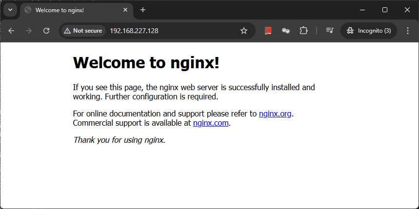

## docker basic commands

Determining the version of docker installed. The below command will list the cline and server version installed on the machine.
```
root@testpc:~# docker version
Client: Docker Engine - Community
 Version:           20.10.17
 API version:       1.41
 Go version:        go1.17.11
 Git commit:        100c701
 Built:             Mon Jun  6 23:02:57 2022
 OS/Arch:           linux/amd64
 Context:           default
 Experimental:      true

Server: Docker Engine - Community
 Engine:
  Version:          20.10.17
  API version:      1.41 (minimum version 1.12)
  Go version:       go1.17.11
  Git commit:       a89b842
  Built:            Mon Jun  6 23:01:03 2022
  OS/Arch:          linux/amd64
  Experimental:     false
 containerd:
  Version:          1.6.6
  GitCommit:        10c12954828e7c7c9b6e0ea9b0c02b01407d3ae1
 runc:
  Version:          1.1.2
  GitCommit:        v1.1.2-0-ga916309
 docker-init:
  Version:          0.19.0
  GitCommit:        de40ad0
root@testpc:~#
```

Below command will give you all details of docker server like running, stopped, drivers e.t.c.
```
root@testpc:~# docker info
Client:
 Context:    default
 Debug Mode: false
 Plugins:
  app: Docker App (Docker Inc., v0.9.1-beta3)
  buildx: Docker Buildx (Docker Inc., v0.8.2-docker)
  compose: Docker Compose (Docker Inc., v2.6.0)
  scan: Docker Scan (Docker Inc., v0.17.0)

Server:
 Containers: 1
  Running: 0
  Paused: 0
  Stopped: 1
 Images: 1
 Server Version: 20.10.17
 Storage Driver: overlay2
  Backing Filesystem: extfs
  Supports d_type: true
  Native Overlay Diff: true
  userxattr: false
 Logging Driver: json-file
 Cgroup Driver: cgroupfs
 Cgroup Version: 1
 Plugins:
  Volume: local
  Network: bridge host ipvlan macvlan null overlay
  Log: awslogs fluentd gcplogs gelf journald json-file local logentries splunk syslog
 Swarm: inactive
 Runtimes: io.containerd.runc.v2 io.containerd.runtime.v1.linux runc
 Default Runtime: runc
 Init Binary: docker-init
 containerd version: 10c12954828e7c7c9b6e0ea9b0c02b01407d3ae1
 runc version: v1.1.2-0-ga916309
 init version: de40ad0
 Security Options:
  apparmor
  seccomp
   Profile: default
 Kernel Version: 5.13.0-51-generic
 Operating System: Ubuntu 20.04.3 LTS
 OSType: linux
 Architecture: x86_64
 CPUs: 2
 Total Memory: 3.798GiB
 Name: testpc
 ID: UX54:KRAB:THGQ:AO5P:PXZX:IIS6:RW2J:ZVPA:DU3T:VSQP:L2V7:ESTY
 Docker Root Dir: /var/lib/docker
 Debug Mode: false
 Registry: https://index.docker.io/v1/
 Labels:
 Experimental: false
 Insecure Registries:
  127.0.0.0/8
 Live Restore Enabled: false

root@testpc:~#
```

If you need help for particular command we can use following cmd:
```
root@testpc:~/docker-repo/01.docker-basics# docker image --help

Usage:  docker image COMMAND

Manage images

Commands:
  build       Build an image from a Dockerfile
  history     Show the history of an image
  import      Import the contents from a tarball to create a filesystem image
  inspect     Display detailed information on one or more images
  load        Load an image from a tar archive or STDIN
  ls          List images
  prune       Remove unused images
  pull        Pull an image or a repository from a registry
  push        Push an image or a repository to a registry
  rm          Remove one or more images
  save        Save one or more images to a tar archive (streamed to STDOUT by default)
  tag         Create a tag TARGET_IMAGE that refers to SOURCE_IMAGE

Run 'docker image COMMAND --help' for more information on a command.
root@testpc:~/docker-repo/01.docker-basics#
```

Running a basic docker continer:
```
root@testpc:~# docker container run hello-world
Unable to find image 'hello-world:latest' locally
latest: Pulling from library/hello-world
c1ec31eb5944: Pull complete
Digest: sha256:d211f485f2dd1dee407a80973c8f129f00d54604d2c90732e8e320e5038a0348
Status: Downloaded newer image for hello-world:latest

Hello from Docker!
This message shows that your installation appears to be working correctly.

To generate this message, Docker took the following steps:
 1. The Docker client contacted the Docker daemon.
 2. The Docker daemon pulled the "hello-world" image from the Docker Hub.
    (amd64)
 3. The Docker daemon created a new container from that image which runs the
    executable that produces the output you are currently reading.
 4. The Docker daemon streamed that output to the Docker client, which sent it
    to your terminal.

To try something more ambitious, you can run an Ubuntu container with:
 $ docker run -it ubuntu bash

Share images, automate workflows, and more with a free Docker ID:
 https://hub.docker.com/

For more examples and ideas, visit:
 https://docs.docker.com/get-started/

root@testpc:~#
```
The above command first tries to seek if the conatiner image is locally available if its not it will download from docker hub and run it.

Now if we look for images it will show below:
```
root@testpc:~/docker-repo/01.docker-basics# docker images
REPOSITORY        TAG       IMAGE ID       CREATED         SIZE
hello-world       latest    d2c94e258dcb   18 months ago   13.3kB
root@testpc:~/docker-repo/01.docker-basics#
```

Now lets run the docker in detatch mode as we want the instance be running on background:
```
root@testpc:~/docker-repo/01.docker-basics# docker container run --publish 80:80 --detach nginx
Unable to find image 'nginx:latest' locally
latest: Pulling from library/nginx
a480a496ba95: Pull complete
f3ace1b8ce45: Pull complete
11d6fdd0e8a7: Pull complete
f1091da6fd5c: Pull complete
40eea07b53d8: Pull complete
6476794e50f4: Pull complete
70850b3ec6b2: Pull complete
Digest: sha256:28402db69fec7c17e179ea87882667f1e054391138f77ffaf0c3eb388efc3ffb
Status: Downloaded newer image for nginx:latest
35e955a5179e7d4923023cae528f6d34d25ce7a42b5571449c18b1d5c8f6b328
root@testpc:~/docker-repo/01.docker-basics#
```
We have downloaded the image off nginx server and now lets try to access it via web browser

