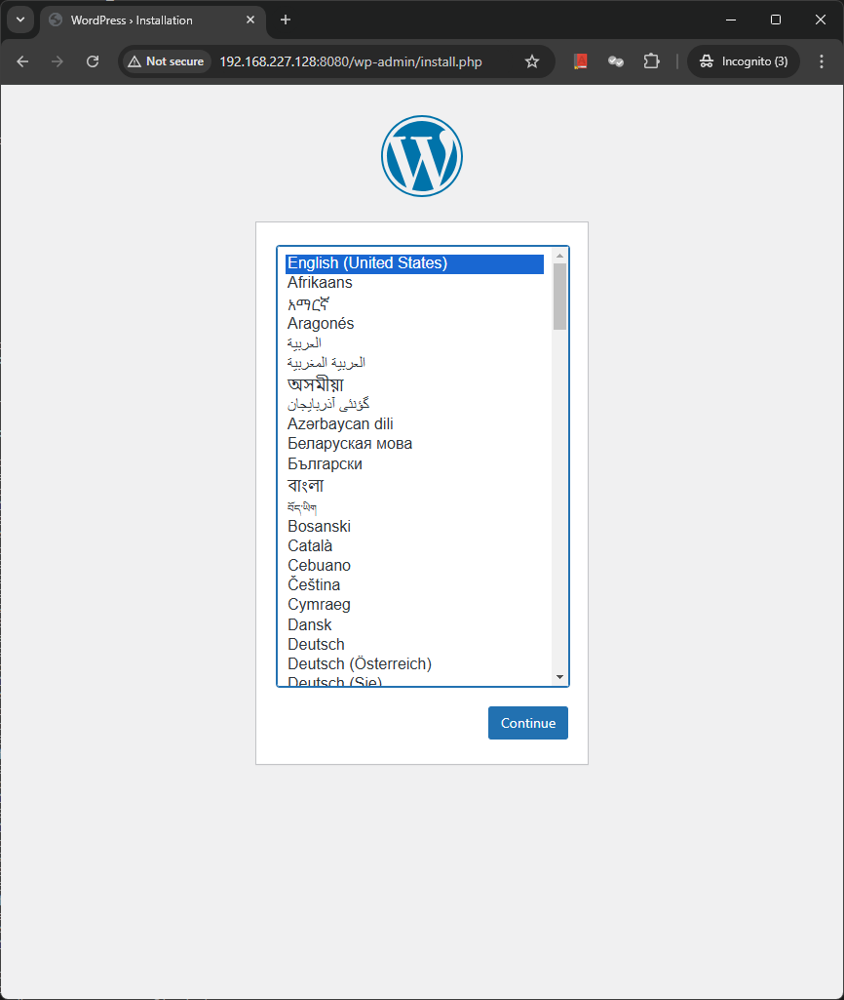

## Docker Compose

Docker compose is used to run multiple containers as a single service. Compose provide relationship between multiple Containers. E.g. a users want to start database server , application server and web server with one YML file. Docker Compose is a three step process.
1. Define app's env with dockerfile so it can be reproduced anywhere.
2. Define the services that make up app in docker-compose.yml, so they can be run together in a isolated enviornment
3. Run docker-compose up and Compose start and runs your entire stack.

Docker compose need to be installed seperately and can be done through instructions in docker website.
```
root@testpc:~# docker compose version
Docker Compose version v2.6.0
root@testpc:~#
```

Docker Compose is based on YML formatted file which describs 
* Containers
* Networks
* Volumes

Components of Docker compose file
* Version statement should be the first line of file
* YML can be used with docker compose comand
* docker-compose.yml if default name of yml file
* Custom name can be used by command using flag -f in compose command.

Basic template of docker-compose file
```
version : '3'

services : #name for the container
   servicename1: # container service name
        image : # optional specify if build specific
        command: # optional relm and CMD specified in image
        environment: # optional similar to -e in Docker run command
        volumes: # optionsl, similar to --mount in docker run
   servicename2:
           .....

volumes: # Optional Mounts a linked path on host machine  that can be accessed in containers

networks: # optional same as Docker network
```

Now we will setup MySQL and Wordpress containers. First lets create a compose file
```
root@testpc:~/bindmount# cat docker-compose.yml
version: '2.6' #Version of YML file

services:
        db:
                image: mysql:5.7
                container_name: db
                volumes:
                        - db_data:/var/lib/mysql
                restart: always
                environment:
                        MYSQL_ROOT_PASSWORD: mypassword
                        MYSQL_DATABASE: wordpress
                        MYSQL_USER: wordpressuser
                        MYSQL_PASSWORD: wordpress

        wordpress:
                depends_on:
                        - db
                image: wordpress:latest
                container_name: wordpress
                ports:
                        - "8080:80"
                restart: always
                environment:
                        WORDPRESS_DB_HOST: db:3306
                        WORDPRESS_DB_USER: wordpressuser
                        WORDPRESS_DB_PASSWORD: wordpress

volumes:
        db_data:
root@testpc:~/bindmount#
```

Now lets run docker compose:
```
root@testpc:~/bindmount# docker compose up -d
[+] Running 34/34
 ⠿ db Pulled                                                                                                                                                                                                                                                                    18.8s
   ⠿ 20e4dcae4c69 Pull complete                                                                                                                                                                                                                                                  5.0s
   ⠿ 1c56c3d4ce74 Pull complete                                                                                                                                                                                                                                                  5.2s
   ⠿ e9f03a1c24ce Pull complete                                                                                                                                                                                                                                                  5.4s
   ⠿ 68c3898c2015 Pull complete                                                                                                                                                                                                                                                  5.9s
   ⠿ 6b95a940e7b6 Pull complete                                                                                                                                                                                                                                                  6.0s
   ⠿ 90986bb8de6e Pull complete                                                                                                                                                                                                                                                  6.2s
   ⠿ ae71319cb779 Pull complete                                                                                                                                                                                                                                                  8.1s
   ⠿ ffc89e9dfd88 Pull complete                                                                                                                                                                                                                                                  8.2s
   ⠿ 43d05e938198 Pull complete                                                                                                                                                                                                                                                 17.2s
   ⠿ 064b2d298fba Pull complete                                                                                                                                                                                                                                                 17.3s
   ⠿ df9a4d85569b Pull complete                                                                                                                                                                                                                                                 17.5s
 ⠿ wordpress Pulled                                                                                                                                                                                                                                                             21.5s
   ⠿ a480a496ba95 Already exists                                                                                                                                                                                                                                                 0.0s
   ⠿ 95ab1cc5ca33 Pull complete                                                                                                                                                                                                                                                  2.9s
   ⠿ 78ee5e1490ca Pull complete                                                                                                                                                                                                                                                 12.7s
   ⠿ e807ae4973d0 Pull complete                                                                                                                                                                                                                                                 12.9s
   ⠿ 8a1846dfbe9a Pull complete                                                                                                                                                                                                                                                 14.1s
   ⠿ 27f1d0bbde81 Pull complete                                                                                                                                                                                                                                                 14.2s
   ⠿ 8fac5e585cd6 Pull complete                                                                                                                                                                                                                                                 14.3s
   ⠿ 7c65c4fca52e Pull complete                                                                                                                                                                                                                                                 14.6s
   ⠿ af2e2799aa38 Pull complete                                                                                                                                                                                                                                                 14.8s
   ⠿ a54527c6f928 Pull complete                                                                                                                                                                                                                                                 16.4s
   ⠿ 3d76291219c3 Pull complete                                                                                                                                                                                                                                                 16.5s
   ⠿ c8e14935230b Pull complete                                                                                                                                                                                                                                                 16.6s
   ⠿ 24cbeb13063d Pull complete                                                                                                                                                                                                                                                 16.7s
   ⠿ 72c6dbb62161 Pull complete                                                                                                                                                                                                                                                 18.0s
   ⠿ f3380324bcbe Pull complete                                                                                                                                                                                                                                                 18.6s
   ⠿ c0fa9286e198 Pull complete                                                                                                                                                                                                                                                 18.7s
   ⠿ 8e16f05140fd Pull complete                                                                                                                                                                                                                                                 18.7s
   ⠿ ed249af23b65 Pull complete                                                                                                                                                                                                                                                 18.8s
   ⠿ acd6e8eb134b Pull complete                                                                                                                                                                                                                                                 20.1s
   ⠿ 4e0d1246ed19 Pull complete                                                                                                                                                                                                                                                 20.1s
   ⠿ 72a1501f3910 Pull complete                                                                                                                                                                                                                                                 20.2s
[+] Running 4/4
 ⠿ Network bindmount_default   Created                                                                                                                                                                                                                                           0.1s
 ⠿ Volume "bindmount_db_data"  Created                                                                                                                                                                                                                                           0.0s
 ⠿ Container db                Started                                                                                                                                                                                                                                           0.9s
 ⠿ Container wordpress         Started                                                                                                                                                                                                                                           1.0s
root@testpc:~/bindmount# docker container ls
CONTAINER ID   IMAGE              COMMAND                  CREATED          STATUS          PORTS                                   NAMES
14646b715466   wordpress:latest   "docker-entrypoint.s…"   12 seconds ago   Up 11 seconds   0.0.0.0:8080->80/tcp, :::8080->80/tcp   wordpress
008deecd9005   mysql:5.7          "docker-entrypoint.s…"   13 seconds ago   Up 12 seconds   3306/tcp, 33060/tcp                     db
root@testpc:~/bindmount#
```

Now lets check if wordpress is accessible:

