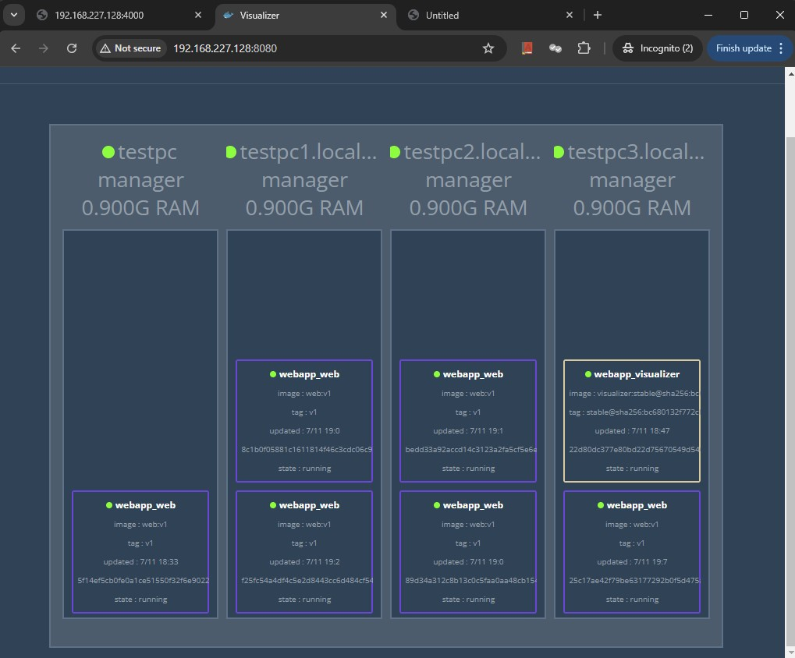
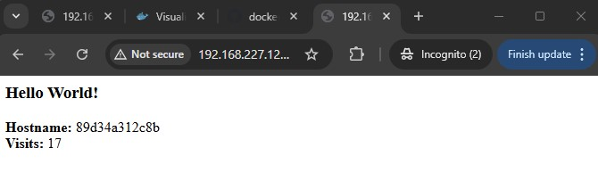
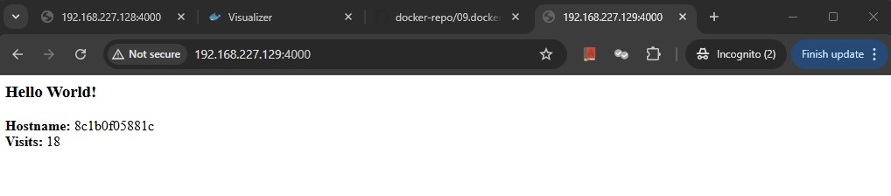

## Docker Stack

Stack is a group of interrelated services that share dependencies and can be orchestrated and scaled together. A single stack is capable of defining and coordinating the functionality of an entire application. And there could be complex application which might have multiple stacks as well.

Docker Stack uses Compose's YAML format and complements the swarm-specific properties for service deployments.

Now we will build stack from dockerfile to compose to docker swarm to docker stack.

Below is the docker image of which will run web server based on flask.
```
# Use an official Python runtime as a parent image
FROM python:2.7-slim

# Set the working directory to /app
WORKDIR /app

# Copy the current directory contents into the container at /app
COPY . /app

# Install any needed packages specified in requirements.txt
RUN pip install --trusted-host pypi.python.org -r requirements.txt

# Make port 80 available to the world outside this container
EXPOSE 80

# Define environment variable
ENV NAME World

# Run app.py when the container launches
CMD ["python", "app.py"]
```

And our python file ```app.py``` will be below:
```
from flask import Flask
from redis import Redis, RedisError
import os
import socket

# Connect to Redis
redis = Redis(host="redis", db=0, socket_connect_timeout=2, socket_timeout=2)

app = Flask(__name__)

@app.route("/")
def hello():
    try:
        visits = redis.incr("counter")
    except RedisError:
        visits = "<i>cannot connect to Redis, counter disabled</i>"

    html = "<h3>Hello {name}!</h3>" \
           "<b>Hostname:</b> {hostname}<br/>" \
           "<b>Visits:</b> {visits}"
    return html.format(name=os.getenv("NAME", "world"), hostname=socket.gethostname(), visits=visits)

if __name__ == "__main__":
    app.run(host='0.0.0.0', port=80)
```
The requirements file will be like below:
```
Flask
Redis
```
And the docker-compose file looks like below:
```
version: "3"
services:
  # Service Name Defined as web
  web:
    image: web:v1 
    # Command used to deploy the Service
    deploy:
      # Run 5 instances of that image as a service called web
      replicas: 5
      resources:
        # Limiting each one to use, at most, 10% of a single core of CPU time and 50MB of RAM.
        limits:
          cpus: "0.1"
          memory: 50M
      # Immediately restart containers if one fails.     
      restart_policy:
        condition: on-failure
    # Map port 4000 on the host to web’s port 80.    
    ports:
      - "4000:80"
    # Define default network  
    networks:
      - webnet
networks:
  webnet:
```
What will above yml file do:
1. check for image web with latest tag
2. Run 5 instances of the service called web
3. Limit each service to 10% CPU and 50M of RAM
4. Restart container immediately if it fails
6. Instruc web's containers to share port 80 to 4000 outsiders via load-balanced network called webnet
7. Define the webnet network with the default settings which is a load balanced overlay network, and it will be created first and used by the image.

Now lets build the image:
```
root@testpc:~/docker-repo/09.docker-stacks/app# docker build --tag=web:v1 .
Sending build context to Docker daemon  6.656kB
Step 1/7 : FROM python:2.7-slim
2.7-slim: Pulling from library/python
123275d6e508: Pull complete
dd1cd6637523: Pull complete
0c4e6d630f2c: Pull complete
13e9cd8f0ea1: Pull complete
Digest: sha256:6c1ffdff499e29ea663e6e67c9b6b9a3b401d554d2c9f061f9a45344e3992363
Status: Downloaded newer image for python:2.7-slim
 ---> eeb27ee6b893
Step 2/7 : WORKDIR /app
 ---> Running in 56562eb9c685
Removing intermediate container 56562eb9c685
 ---> 9e06c3c5d3f7
Step 3/7 : COPY . /app
 ---> 86dacda3b823
Step 4/7 : RUN pip install --trusted-host pypi.python.org -r requirements.txt
 ---> Running in f172417eae57
DEPRECATION: Python 2.7 reached the end of its life on January 1st, 2020. Please upgrade your Python as Python 2.7 is no longer maintained. A future version of pip will drop support for Python 2.7. More details about Python 2 support in pip, can be found at https://pip.pypa.io/en/latest/development/release-process/#python-2-support
Collecting Flask
  Downloading Flask-1.1.4-py2.py3-none-any.whl (94 kB)
Collecting Redis
  Downloading redis-3.5.3-py2.py3-none-any.whl (72 kB)
Collecting click<8.0,>=5.1
  Downloading click-7.1.2-py2.py3-none-any.whl (82 kB)
Collecting Werkzeug<2.0,>=0.15
  Downloading Werkzeug-1.0.1-py2.py3-none-any.whl (298 kB)
Collecting Jinja2<3.0,>=2.10.1
  Downloading Jinja2-2.11.3-py2.py3-none-any.whl (125 kB)
Collecting itsdangerous<2.0,>=0.24
  Downloading itsdangerous-1.1.0-py2.py3-none-any.whl (16 kB)
Collecting MarkupSafe>=0.23
  Downloading MarkupSafe-1.1.1-cp27-cp27mu-manylinux1_x86_64.whl (24 kB)
Installing collected packages: click, Werkzeug, MarkupSafe, Jinja2, itsdangerous, Flask, Redis
Successfully installed Flask-1.1.4 Jinja2-2.11.3 MarkupSafe-1.1.1 Redis-3.5.3 Werkzeug-1.0.1 click-7.1.2 itsdangerous-1.1.0
WARNING: You are using pip version 20.0.2; however, version 20.3.4 is available.
You should consider upgrading via the '/usr/local/bin/python -m pip install --upgrade pip' command.
Removing intermediate container f172417eae57
 ---> 4388309d6068
Step 5/7 : EXPOSE 80
 ---> Running in 5fb82a3c143b
Removing intermediate container 5fb82a3c143b
 ---> c48b3911e2d3
Step 6/7 : ENV NAME World
 ---> Running in 5165b78cafe0
Removing intermediate container 5165b78cafe0
 ---> 5541c0a1e6f8
Step 7/7 : CMD ["python", "app.py"]
 ---> Running in ee30a9822dad
Removing intermediate container ee30a9822dad
 ---> 09dbfea10f44
Successfully built 09dbfea10f44
Successfully tagged web:v1
root@testpc:~/docker-repo/09.docker-stacks/app# 
```

Lets view the image in our local repository:
```
root@testpc:~/docker-repo/09.docker-stacks/app# docker images | grep -B 1 web
REPOSITORY                              TAG        IMAGE ID       CREATED          SIZE
web                                     v1         09dbfea10f44   58 seconds ago   159MB
root@testpc:~/docker-repo/09.docker-stacks/app#
```
Now lets deploy the docker stack:
```
root@testpc:~# docker stack --help

Usage:  docker stack [OPTIONS] COMMAND

Manage Docker stacks

Options:
      --orchestrator string   Orchestrator to use (swarm|kubernetes|all)

Commands:
  deploy      Deploy a new stack or update an existing stack
  ls          List stacks
  ps          List the tasks in the stack
  rm          Remove one or more stacks
  services    List the services in the stack

Run 'docker stack COMMAND --help' for more information on a command.
root@testpc:~# 
root@testpc:~/docker-repo/09.docker-stacks/app# docker stack deploy -c docker-compose.yml webapp
Creating network webapp_webnet
Creating service webapp_web
root@testpc:~/docker-repo/09.docker-stacks/app# 
```
As shown above network and service are created with prefix webapp.
```
root@testpc:~/docker-repo/09.docker-stacks/app# docker network ls | grep "NETWORK\|webapp"
NETWORK ID     NAME              DRIVER    SCOPE
skyou62m6pbw   webapp_webnet     overlay   swarm
root@testpc:~/docker-repo/09.docker-stacks/app# 
root@testpc:~/docker-repo/09.docker-stacks/app# docker stack ls
NAME      SERVICES   ORCHESTRATOR
webapp    1          Swarm
root@testpc:~/docker-repo/09.docker-stacks/app# 
```
A single container running in this Service is called Task. So single Service can execute multiple Tasks.


Now if we check the services running under the docker stack we created we can use below:
```
root@testpc:~/docker-repo/09.docker-stacks/app# docker stack services webapp
ID             NAME         MODE         REPLICAS   IMAGE     PORTS
ojrrn3btkv2c   webapp_web   replicated   5/5        web:v1    *:4000->80/tcp
root@testpc:~/docker-repo/09.docker-stacks/app# 
root@testpc:~/docker-repo/09.docker-stacks/app# docker service ps  webapp_web
ID             NAME               IMAGE     NODE                  DESIRED STATE   CURRENT STATE             ERROR                     PORTS
l0vk4ex09c34   webapp_web.1       web:v1    testpc                Running         Running 13 minutes ago
t5d9xqkcs8v9    \_ webapp_web.1   web:v1    testpc3.localdomain   Shutdown        Rejected 14 minutes ago   "No such image: web:v1"   
0mw3supzz2h2    \_ webapp_web.1   web:v1    testpc3.localdomain   Shutdown        Rejected 14 minutes ago   "No such image: web:v1"   
wgz1yu0dxf9y    \_ webapp_web.1   web:v1    testpc2.localdomain   Shutdown        Rejected 14 minutes ago   "No such image: web:v1"   
n36xizgd3rku    \_ webapp_web.1   web:v1    testpc2.localdomain   Shutdown        Rejected 14 minutes ago   "No such image: web:v1"   
n4qycei5cyad   webapp_web.2       web:v1    testpc                Running         Running 13 minutes ago
jd1teke56acm    \_ webapp_web.2   web:v1    testpc3.localdomain   Shutdown        Rejected 14 minutes ago   "No such image: web:v1"   
o99tkuhqrr03    \_ webapp_web.2   web:v1    testpc3.localdomain   Shutdown        Rejected 14 minutes ago   "No such image: web:v1"   
hmhwl2uiqnr2    \_ webapp_web.2   web:v1    testpc2.localdomain   Shutdown        Rejected 14 minutes ago   "No such image: web:v1"   
gg6inh81h8l0    \_ webapp_web.2   web:v1    testpc1.localdomain   Shutdown        Rejected 14 minutes ago   "No such image: web:v1"   
i59au9o4hiqg   webapp_web.3       web:v1    testpc                Running         Running 13 minutes ago
z5mipof90yjy    \_ webapp_web.3   web:v1    testpc3.localdomain   Shutdown        Rejected 14 minutes ago   "No such image: web:v1"   
eipd4e8e0gpi    \_ webapp_web.3   web:v1    testpc3.localdomain   Shutdown        Rejected 14 minutes ago   "No such image: web:v1"   
pzo5s9imnpnx    \_ webapp_web.3   web:v1    testpc2.localdomain   Shutdown        Rejected 14 minutes ago   "No such image: web:v1"   
pzsrzpgby2ve    \_ webapp_web.3   web:v1    testpc1.localdomain   Shutdown        Rejected 14 minutes ago   "No such image: web:v1"
nvzr1nsv4q1q   webapp_web.4       web:v1    testpc                Running         Running 13 minutes ago
tpuvo37rj81z    \_ webapp_web.4   web:v1    testpc3.localdomain   Shutdown        Rejected 14 minutes ago   "No such image: web:v1"
grh0o5uqvj1i    \_ webapp_web.4   web:v1    testpc3.localdomain   Shutdown        Rejected 14 minutes ago   "No such image: web:v1"
8yutgsofnew0    \_ webapp_web.4   web:v1    testpc2.localdomain   Shutdown        Rejected 14 minutes ago   "No such image: web:v1"
snvtfuuy4slc    \_ webapp_web.4   web:v1    testpc1.localdomain   Shutdown        Rejected 14 minutes ago   "No such image: web:v1"
o5em8a4rybf4   webapp_web.5       web:v1    testpc                Running         Running 14 minutes ago
1ucivr98vbns    \_ webapp_web.5   web:v1    testpc3.localdomain   Shutdown        Rejected 14 minutes ago   "No such image: web:v1"
m0kdvyw2k3hs    \_ webapp_web.5   web:v1    testpc2.localdomain   Shutdown        Rejected 14 minutes ago   "No such image: web:v1"
xknaktn6slgm    \_ webapp_web.5   web:v1    testpc1.localdomain   Shutdown        Rejected 14 minutes ago   "No such image: web:v1"
l420sun298m8    \_ webapp_web.5   web:v1    testpc1.localdomain   Shutdown        Rejected 14 minutes ago   "No such image: web:v1"
root@testpc:~/docker-repo/09.docker-stacks/app#
```
As we can see its not able to start on other services, that because we don't have image created on other nodes.

Scale service in Docker Stack:
Scale means how we can alter the number of resource particular service. We can scale Service by changing the YAML file and redeploy the YAML to reflect the changes. But redploying the services it will not have any downtime, the services will not be down, but will scale up in running mode.
```
root@testpc:~/docker-repo/09.docker-stacks/app# vi docker-compose.yml
root@testpc:~/docker-repo/09.docker-stacks/app# vi docker-compose.yml
root@testpc:~/docker-repo/09.docker-stacks/app# cat docker-compose.yml | grep rep
      replicas: 6
root@testpc:~/docker-repo/09.docker-stacks/app# cat docker-compose.yml | grep me
  # Service Name Defined as web
        # Limiting each one to use, at most, 10% of a single core of CPU time and 50MB of RAM.
          memory: 60M
      # Immediately restart containers if one fails.
root@testpc:~/docker-repo/09.docker-stacks/app#
```
Now we have made changes to replicas and memory lets redeply the service.
```
root@testpc:~# docker service ps webapp_web | grep '\btestpc\b'
l0vk4ex09c34   webapp_web.1       web:v1    testpc                Running         Running 21 minutes ago
n4qycei5cyad   webapp_web.2       web:v1    testpc                Running         Running 21 minutes ago
i59au9o4hiqg   webapp_web.3       web:v1    testpc                Running         Running 21 minutes ago
nvzr1nsv4q1q   webapp_web.4       web:v1    testpc                Running         Running 21 minutes ago
o5em8a4rybf4   webapp_web.5       web:v1    testpc                Running         Running 21 minutes ago
root@testpc:~# docker stack ls
NAME      SERVICES   ORCHESTRATOR
webapp    1          Swarm
root@testpc:~# docker service ls
ID             NAME         MODE         REPLICAS   IMAGE     PORTS
ojrrn3btkv2c   webapp_web   replicated   5/5        web:v1    *:4000->80/tcp
root@testpc:~# docker service ps webapp_web | grep '\btestpc\b'
jdk8gaopwi63   webapp_web.1       web:v1    testpc                Ready           Ready less than a second ago
n4qycei5cyad   webapp_web.2       web:v1    testpc                Running         Running 23 minutes ago
i59au9o4hiqg   webapp_web.3       web:v1    testpc                Running         Running 23 minutes ago
nvzr1nsv4q1q   webapp_web.4       web:v1    testpc                Running         Running 23 minutes ago
o5em8a4rybf4   webapp_web.5       web:v1    testpc                Running         Running 23 minutes ago
root@testpc:~#
root@testpc:~# docker service ps webapp_web | grep '\btestpc\b'
jdk8gaopwi63   webapp_web.1       web:v1    testpc                Running         Running 30 seconds ago
n4qycei5cyad   webapp_web.2       web:v1    testpc                Running         Running 23 minutes ago
i59au9o4hiqg   webapp_web.3       web:v1    testpc                Running         Running 23 minutes ago
nvzr1nsv4q1q   webapp_web.4       web:v1    testpc                Running         Running 23 minutes ago
o5em8a4rybf4   webapp_web.5       web:v1    testpc                Running         Running 24 minutes ago
x6au2hgrl7oz   webapp_web.6       web:v1    testpc                Running         Running 27 seconds ago
root@testpc:~#
```
In this way the docker swarm will recycle the apps in one by one in round robin matter and the load balance will take care of the reblancing the load when the node is on recycle mode or spin mode. 

Add new Service in Stack. (Add Visualizer). Visualizer is basically an official app provided by the Docker community and we can easily find out on hub.docker.com.
```
root@testpc:~/docker-repo/09.docker-stacks/app# cat docker-compose.yml 
version: "3"
services:
  # Service Name Defined as web
  web:
    image: web:v1
    # Command used to deploy the Service
    deploy:
      # Run 5 instances of that image as a service called web
      replicas: 6
      resources:
        # Limiting each one to use, at most, 10% of a single core of CPU time and 50MB of RAM.
        limits:
          cpus: "0.1"
          memory: 60M
      # Immediately restart containers if one fails.     
      restart_policy:
        condition: on-failure
    # Map port 4000 on the host to web’s port 80.    
    ports:
      - "4000:80"
    # Define default network
    networks:
      - webnet

  visualizer:
        image: dockersamples/visualizer:stable
        ports:
                - "8080:8080"
        volumes:
                - "/var/run/docker.sock:/var/run/docker.sock"    
        deploy:
           placement:
                   constraints: [node.role== manager]
        networks:
                - webnet
networks:
  webnet:
root@testpc:~/docker-repo/09.docker-stacks/app#
```
The constraints will enforce this will run only in manager node. Now lets redeply the container:
```
root@testpc:~/docker-repo/09.docker-stacks/app# docker stack deploy -c docker-compose.yml webapp
Updating service webapp_web (id: ojrrn3btkv2ceqnte1kzord5a)
image web:v1 could not be accessed on a registry to record
its digest. Each node will access web:v1 independently,
possibly leading to different nodes running different
versions of the image.

Creating service webapp_visualizer
root@testpc:~/docker-repo/09.docker-stacks/app# 
root@testpc:~/docker-repo/09.docker-stacks/app# docker service ls
ID             NAME                MODE         REPLICAS   IMAGE                             PORTS
q3hiaokb7i1h   webapp_visualizer   replicated   1/1        dockersamples/visualizer:stable   *:8080->8080/tcp
ojrrn3btkv2c   webapp_web          replicated   5/6        web:v1                            *:4000->80/tcp
root@testpc:~/docker-repo/09.docker-stacks/app#
```
And the visualizer looks like below:


Now we will look on presistance data problem with regards to docker stack. This will be a problem as the docker services can run on any of the node as it can failover to any node or it can run in any node and the volume may not present in another node. So how to solve this problem. We will mount the container directory with our local host directory and we can restrict the service to execute on specific node. So we will extend our problem by adding a new service for Redis.

We have made few changes to the docker yaml file ```command: redis-server --appendonly yes``` which implies the contents will not be overwritten everytime the node is started insted it will append only.
```
root@testpc:~/docker-repo/09.docker-stacks/app# 
root@testpc:~/docker-repo/09.docker-stacks/app# 
root@testpc:~/docker-repo/09.docker-stacks/app# docker stack deploy -c docker-compose.yml webapp
Updating service webapp_web (id: ojrrn3btkv2ceqnte1kzord5a)
image web:v1 could not be accessed on a registry to record
its digest. Each node will access web:v1 independently,
possibly leading to different nodes running different
versions of the image.

Updating service webapp_visualizer (id: q3hiaokb7i1hvkrp9mgzh24aa)
Creating service webapp_redis
root@testpc:~/docker-repo/09.docker-stacks/app#
root@testpc:~/docker-repo/09.docker-stacks/app# docker service ls
ID             NAME                MODE         REPLICAS   IMAGE                             PORTS
ryyd20ezvkq4   webapp_redis        replicated   1/1        redis:latest                      *:6379->6379/tcp
q3hiaokb7i1h   webapp_visualizer   replicated   1/1        dockersamples/visualizer:stable   *:8080->8080/tcp
ojrrn3btkv2c   webapp_web          replicated   6/6        web:v1                            *:4000->80/tcp
root@testpc:~/docker-repo/09.docker-stacks/app#
root@testpc:~/docker-repo/09.docker-stacks/app# docker service ps webapp_redis
ID             NAME             IMAGE          NODE      DESIRED STATE   CURRENT STATE            ERROR     PORTS
wkf8ou29s4y7   webapp_redis.1   redis:latest   testpc    Running         Running 32 seconds ago
root@testpc:~/docker-repo/09.docker-stacks/app# docker container ls
CONTAINER ID   IMAGE          COMMAND                  CREATED              STATUS              PORTS      NAMES
df36b86cdf1d   redis:latest   "docker-entrypoint.s…"   About a minute ago   Up About a minute   6379/tcp   webapp_redis.1.wkf8ou29s4y73i98hgud74zcs
5f14ef5cb0fe   web:v1         "python app.py"          56 minutes ago       Up 56 minutes       80/tcp     webapp_web.1.jdk8gaopwi63wp263f12l81m4
root@testpc:~/docker-repo/09.docker-stacks/app#
```

Now lets visit our application which we deployed:


Now lets remove the redis database and explore:

```
root@testpc:~/docker-repo/09.docker-stacks/app# docker service rm webapp_redis
webapp_redis
root@testpc:~/docker-repo/09.docker-stacks/app# docker service ls
ID             NAME                MODE         REPLICAS   IMAGE                             PORTS
q3hiaokb7i1h   webapp_visualizer   replicated   1/1        dockersamples/visualizer:stable   *:8080->8080/tcp
ojrrn3btkv2c   webapp_web          replicated   6/6        web:v1                            *:4000->80/tcp
root@testpc:~/docker-repo/09.docker-stacks/app#
root@testpc:~/bindmount/pgdata# ls -ltr
total 8
drwx------ 2 systemd-coredump systemd-coredump 4096 Nov  7 19:28 appendonlydir
-rw------- 1 systemd-coredump systemd-coredump  104 Nov  7 19:36 dump.rdb
root@testpc:~/bindmount/pgdata# pwd
/root/bindmount/pgdata
root@testpc:~/bindmount/pgdata#
```
We can see that the data exists in the pysical directory, now lets again start the docker:
```
root@testpc:~/docker-repo/09.docker-stacks/app# docker stack depl
oy -c docker-compose.yml webapp
Updating service webapp_visualizer (id: q3hiaokb7i1hvkrp9mgzh24aa)
Creating service webapp_redis
Updating service webapp_web (id: ojrrn3btkv2ceqnte1kzord5a)
image web:v1 could not be accessed on a registry to record
its digest. Each node will access web:v1 independently,
possibly leading to different nodes running different
versions of the image.

root@testpc:~/docker-repo/09.docker-stacks/app# 
root@testpc:~/docker-repo/09.docker-stacks/app# docker service ls
ID             NAME                MODE         REPLICAS   IMAGE                             PORTS
xp2bclcfr6ou   webapp_redis        replicated   1/1        redis:latest                      *:6379->6379/tcp
q3hiaokb7i1h   webapp_visualizer   replicated   1/1        dockersamples/visualizer:stable   *:8080->8080/tcp
ojrrn3btkv2c   webapp_web          replicated   6/6        web:v1                            *:4000->80/tcp
root@testpc:~/docker-repo/09.docker-stacks/app#
```
Now lets visit our web app again and see how things are looking:

We can see the data has been preserved.

Now lets remove the docker stack:
```
root@testpc:~/docker-repo/09.docker-stacks/app# docker stack rm webapp
Removing service webapp_redis
Removing service webapp_visualizer
Removing service webapp_web
Removing network webapp_webnet
root@testpc:~/docker-repo/09.docker-stacks/app# 
root@testpc:~/docker-repo/09.docker-stacks/app#
```

Now finally we will test distributing voting app. Lets prepare the docker yaml file.
```
root@testpc:~/docker-repo/09.docker-stacks/app# cat docker-stack.yml
# this file is meant for Docker Swarm stacks only
# trying it in compose will fail because of multiple replicas trying to bind to the same port
# Swarm currently does not support Compose Spec, so we'll pin to the older version 3.9

version: "3.9"

services:

  redis:
    image: redis:alpine
    networks:
      - frontend

  db:
    image: postgres:15-alpine
    environment:
      POSTGRES_USER: "postgres"
      POSTGRES_PASSWORD: "postgres"
    volumes:
      - db-data:/var/lib/postgresql/data
    networks:
      - backend

  vote:
    image: dockersamples/examplevotingapp_vote
    ports:
      - 8080:80
    networks:
      - frontend
    deploy:
      replicas: 2

  result:
    image: dockersamples/examplevotingapp_result
    ports:
      - 8081:80
    networks:
      - backend

  worker:
    image: dockersamples/examplevotingapp_worker
    networks:
      - frontend
      - backend
    deploy:
      replicas: 2

  visualizer:
        image: dockersamples/visualizer:stable
        ports:
                - "8082:8080"
        stop_grace_period: 1m30s
        volumes:
                - "/var/run/docker.sock:/var/run/docker.sock"    
        deploy:
           placement:
                   constraints: [node.role== manager]
        networks:
                - frontend

networks:
  frontend:
  backend:

volumes:
  db-data:
root@testpc:~/docker-repo/09.docker-stacks/app#
```
Now lets deploy the stack
```
root@testpc:~/docker-repo/09.docker-stacks/app# docker stack deploy -c docker-stack.yml voteingstack
Creating network voteingstack_frontend
Creating network voteingstack_backend
Creating service voteingstack_worker
Creating service voteingstack_visualizer
Creating service voteingstack_redis
Creating service voteingstack_db
Creating service voteingstack_vote
Creating service voteingstack_result
root@testpc:~/docker-repo/09.docker-stacks/app# docker stack ls
NAME           SERVICES   ORCHESTRATOR
voteingstack   6          Swarm
root@testpc:~/docker-repo/09.docker-stacks/app# docker stack ps voteingstack 
ID             NAME                        IMAGE                                          NODE                  DESIRED STATE   CURRENT STATE                ERROR     PORTS
t0y96u25aqzv   voteingstack_db.1           postgres:15-alpine                             testpc2.localdomain   Running         Running about a minute ago
18ardtcjrvug   voteingstack_redis.1        redis:alpine                                   testpc3.localdomain   Running         Running 58 seconds ago
jpkgbqfvx90g   voteingstack_result.1       dockersamples/examplevotingapp_result:latest   testpc1.localdomain   Running         Running 55 seconds ago
2tt1xlstw85a   voteingstack_visualizer.1   dockersamples/visualizer:stable                testpc                Running         Running about a minute ago
om21fqg90j0d   voteingstack_vote.1         dockersamples/examplevotingapp_vote:latest     testpc                Running         Running about a minute ago
pzh7mnkluuc7   voteingstack_vote.2         dockersamples/examplevotingapp_vote:latest     testpc3.localdomain   Running         Running 59 seconds ago
q0xd98qgsz1r   voteingstack_worker.1       dockersamples/examplevotingapp_worker:latest   testpc2.localdomain   Running         Running about a minute ago
wusnx4kbvw9i   voteingstack_worker.2       dockersamples/examplevotingapp_worker:latest   testpc1.localdomain   Running         Running about a minute ago
root@testpc:~/docker-repo/09.docker-stacks/app# 
root@testpc:~/docker-repo/09.docker-stacks/app# docker stack services voteingstack 
ID             NAME                      MODE         REPLICAS   IMAGE                                          PORTS
uacnakrn4e0b   voteingstack_db           replicated   1/1        postgres:15-alpine
sr7lvlyqd6zc   voteingstack_redis        replicated   1/1        redis:alpine
topql31ojxze   voteingstack_result       replicated   1/1        dockersamples/examplevotingapp_result:latest   *:8081->80/tcp
x3yz2av8g1br   voteingstack_visualizer   replicated   1/1        dockersamples/visualizer:stable                *:8082->8080/tcp
vp92mpkvrez5   voteingstack_vote         replicated   2/2        dockersamples/examplevotingapp_vote:latest     *:8080->80/tcp
thm99mfept6s   voteingstack_worker       replicated   2/2        dockersamples/examplevotingapp_worker:latest   
root@testpc:~/docker-repo/09.docker-stacks/app# 
root@testpc:~/docker-repo/09.docker-stacks/app# docker service logs voteingstack_worker
voteingstack_worker.1.q0xd98qgsz1r@testpc2.localdomain    | Waiting for db
voteingstack_worker.1.q0xd98qgsz1r@testpc2.localdomain    | Connected to db
voteingstack_worker.1.q0xd98qgsz1r@testpc2.localdomain    | Found redis at 10.0.5.10
voteingstack_worker.1.q0xd98qgsz1r@testpc2.localdomain    | Connecting to redis
voteingstack_worker.2.wusnx4kbvw9i@testpc1.localdomain    | Waiting for db
voteingstack_worker.2.wusnx4kbvw9i@testpc1.localdomain    | Connected to db
voteingstack_worker.2.wusnx4kbvw9i@testpc1.localdomain    | Found redis at 10.0.5.10
voteingstack_worker.2.wusnx4kbvw9i@testpc1.localdomain    | Connecting to redis
root@testpc:~/docker-repo/09.docker-stacks/app#
```